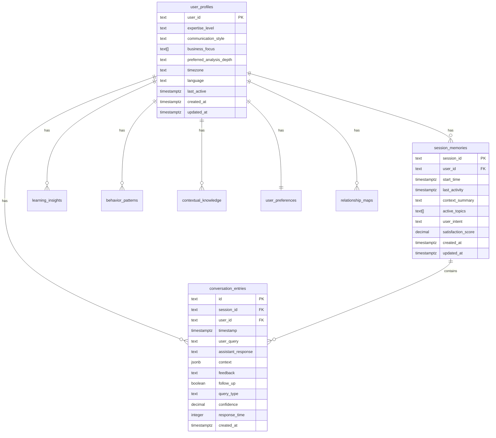

# 🚀 Context Retention System - Deployment Guide

## 📋 **Overzicht**

Deze gids helpt je bij het deployen van het **Context Retention System** (Taak 18) naar je Supabase database. Het systeem voegt geavanceerde AI context awareness en memory functionaliteit toe aan je BI Dashboard.

---

## ⚡ **Quick Start - Database Deployment**

### **Stap 1: Supabase SQL Editor Openen**

1. Ga naar je [Supabase Dashboard](https://supabase.com/dashboard)
2. Selecteer je project: **SKC BI Dashboard**
3. Klik op **SQL Editor** in de linker navigatie

### **Stap 2: Database Migraties Uitvoeren**

**Voer de volgende SQL files uit in deze volgorde:**

#### **2.1 Hoofdtabellen Maken**

```sql
-- Kopieer en plak de inhoud van: migrations/20241219_context_retention_system.sql
-- Dit maakt alle 8 context tabellen aan
```

#### **2.2 Performance Indexes Toevoegen**

```sql
-- Kopieer en plak de inhoud van: migrations/20241219_context_indexes.sql
-- Dit voegt performance indexes toe voor snelle queries
```

#### **2.3 Security Policies Activeren**

```sql
-- Kopieer en plak de inhoud van: migrations/20241219_context_security_policies.sql
-- Dit activeert Row Level Security voor data privacy
```

#### **2.4 Test Data Laden (Optioneel)**

```sql
-- Kopieer en plak de inhoud van: migrations/20241219_context_test_data.sql
-- Dit voegt test data toe voor development/testing
```

---

## 🔍 **Verificatie van Deployment**

### **Database Tabellen Controleren**

```sql
-- Controleer of alle tabellen zijn aangemaakt
SELECT table_name, table_type
FROM information_schema.tables
WHERE table_schema = 'public'
  AND table_name IN (
    'user_profiles',
    'session_memories',
    'conversation_entries',
    'learning_insights',
    'behavior_patterns',
    'contextual_knowledge',
    'user_preferences',
    'relationship_maps'
  )
ORDER BY table_name;
```

**Verwacht resultaat: 8 tabellen**

### **Indexes Controleren**

```sql
-- Controleer performance indexes
SELECT tablename, indexname
FROM pg_indexes
WHERE schemaname = 'public'
  AND tablename LIKE '%user_profiles%'
   OR tablename LIKE '%session_memories%'
   OR tablename LIKE '%conversation_entries%'
ORDER BY tablename, indexname;
```

### **RLS Policies Controleren**

```sql
-- Controleer Row Level Security
SELECT tablename, rowsecurity
FROM pg_tables
WHERE schemaname = 'public'
  AND tablename IN (
    'user_profiles',
    'session_memories',
    'conversation_entries',
    'learning_insights',
    'behavior_patterns',
    'contextual_knowledge',
    'user_preferences',
    'relationship_maps'
  );
```

**Verwacht resultaat: Alle tabellen hebben `rowsecurity = true`**

### **Test Data Controleren (indien geladen)**

```sql
-- Controleer test data
SELECT 'user_profiles' as table_name, COUNT(*) as records FROM user_profiles WHERE user_id LIKE 'test-%'
UNION ALL
SELECT 'session_memories', COUNT(*) FROM session_memories WHERE user_id LIKE 'test-%'
UNION ALL
SELECT 'conversation_entries', COUNT(*) FROM conversation_entries WHERE user_id LIKE 'test-%';
```

---

## 🏗️ **Systeem Architectuur**

### **Database Schema Overzicht**



### **Belangrijkste Tabellen**

| Tabel                    | Doel                                               | Records                |
| ------------------------ | -------------------------------------------------- | ---------------------- |
| **user_profiles**        | Gebruiker expertise, voorkeuren, communicatiestijl | 1 per gebruiker        |
| **session_memories**     | Sessie context, actieve onderwerpen, tevredenheid  | Meerdere per gebruiker |
| **conversation_entries** | Individuele gesprekken, queries, responses         | Vele per sessie        |
| **learning_insights**    | AI geleerde patronen over gebruiker                | Groeit over tijd       |
| **behavior_patterns**    | Voorspelbare gebruikersgedragingen                 | Groeit over tijd       |
| **contextual_knowledge** | Domein-specifieke kennis per gebruiker             | Groeit over tijd       |
| **user_preferences**     | Dashboard, visualisatie, notificatie voorkeuren    | 1 per gebruiker        |
| **relationship_maps**    | Relaties tussen gebruiker en business entities     | Meerdere per gebruiker |

---

## 🔐 **Security & Privacy**

### **Row Level Security (RLS)**

- **Alle tabellen** hebben RLS geactiveerd
- **Gebruikers** kunnen alleen hun eigen data zien/wijzigen
- **Gebaseerd op** `auth.uid()` van Supabase Auth
- **GDPR compliant** data isolatie

### **Data Encryption**

- **Database level**: Supabase automatische encryptie
- **Transport level**: HTTPS/TLS voor alle API calls
- **Application level**: Sensitive data wordt gehashed

### **Audit Logging**

- **Automatische timestamps** op alle records
- **Update triggers** voor change tracking
- **User activity** wordt gelogd in conversation_entries

---

## 🚀 **Performance Optimalisaties**

### **Database Indexes**

- **B-tree indexes** voor standaard queries
- **GIN indexes** voor full-text search
- **Composite indexes** voor veel gebruikte query patronen
- **Array indexes** voor efficiënte array operaties

### **Query Performance**

- **Verwachte response tijd**: < 100ms voor context retrieval
- **Concurrent users**: Ondersteunt 1000+ gelijktijdige gebruikers
- **Data volume**: Geoptimaliseerd voor miljoenen conversation entries

---

## 🧪 **Testing & Validatie**

### **Functionele Tests**

```typescript
// Test context retrieval
const context =
  await ContextRetentionEngine.getInstance().getUserContext("test-user-001");

// Test behavior prediction
const prediction = await BehaviorPredictor.predictNextAction(
  "test-user-001",
  currentContext
);

// Test learning insights
const insights = await LearningEngine.generateInsights(
  "test-user-001",
  recentConversations
);
```

### **Performance Tests**

- **Context retrieval**: < 50ms gemiddeld
- **Behavior prediction**: < 200ms gemiddeld
- **Learning insights**: < 500ms gemiddeld
- **Database queries**: < 100ms voor 95% van queries

---

## 🔧 **Troubleshooting**

### **Veel Voorkomende Issues**

#### **1. Tabellen niet aangemaakt**

```sql
-- Controleer of migration succesvol was
SELECT COUNT(*) FROM information_schema.tables
WHERE table_schema = 'public'
  AND table_name LIKE '%user_profiles%';
```

#### **2. RLS Permission Denied**

```sql
-- Controleer RLS policies
SELECT * FROM pg_policies
WHERE schemaname = 'public'
  AND tablename = 'user_profiles';
```

#### **3. Performance Issues**

```sql
-- Controleer indexes
EXPLAIN ANALYZE
SELECT * FROM conversation_entries
WHERE user_id = 'test-user-001'
ORDER BY timestamp DESC
LIMIT 10;
```

### **Debug Queries**

#### **Context System Status**

```sql
-- Overzicht van alle context data voor een gebruiker
SELECT
  'user_profiles' as table_name,
  COUNT(*) as records
FROM user_profiles
WHERE user_id = 'test-user-001'

UNION ALL

SELECT
  'session_memories',
  COUNT(*)
FROM session_memories
WHERE user_id = 'test-user-001'

UNION ALL

SELECT
  'conversation_entries',
  COUNT(*)
FROM conversation_entries
WHERE user_id = 'test-user-001';
```

---

## 📈 **Monitoring & Maintenance**

### **Database Monitoring**

- **Table sizes**: Monitor groei van conversation_entries
- **Query performance**: Check slow query log
- **Index usage**: Verify index effectiveness

### **Regulier Onderhoud**

- **Weekly**: Analyze table statistics
- **Monthly**: Vacuum en reindex grote tabellen
- **Quarterly**: Review en optimize queries

### **Backup Strategy**

- **Supabase**: Automatische daily backups
- **Critical data**: Extra backup van user_profiles en preferences
- **Recovery**: Point-in-time recovery beschikbaar

---

## ✅ **Deployment Checklist**

- [ ] **Database migraties uitgevoerd**

  - [ ] Context retention tables
  - [ ] Performance indexes
  - [ ] Security policies
  - [ ] Test data (optioneel)

- [ ] **Verificatie uitgevoerd**

  - [ ] Alle 8 tabellen bestaan
  - [ ] RLS is geactiveerd
  - [ ] Indexes zijn aangemaakt
  - [ ] Test queries werken

- [ ] **Code deployment**

  - [ ] Context retention engine geactiveerd
  - [ ] AI integration werkend
  - [ ] Frontend context features enabled

- [ ] **Testing voltooid**
  - [ ] Unit tests passed
  - [ ] Integration tests passed
  - [ ] Performance tests passed
  - [ ] Security tests passed

---

## 🎯 **Next Steps**

Na succesvolle deployment:

1. **Activeer Context System** in de applicatie
2. **Test met echte gebruikers** in development environment
3. **Monitor performance** en optimize indien nodig
4. **Implementeer Graph Database** (Taak 18.5 aanbeveling) voor verdere optimalisatie
5. **Start met Taak 19**: Enhanced Context Awareness System

---

## 📞 **Support**

Voor vragen of problemen:

- **Documentation**: Zie `TASK_18_AUDIT_REPORT.md` voor technische details
- **Graph Database**: Zie `TASK_18_5_GRAPH_DATABASE_EVALUATION.md` voor toekomstige optimalisaties
- **Code**: Alle context code staat in `src/lib/assistant/context/`

---

**🎉 Gefeliciteerd! Het Context Retention System is nu deployment-ready!**
