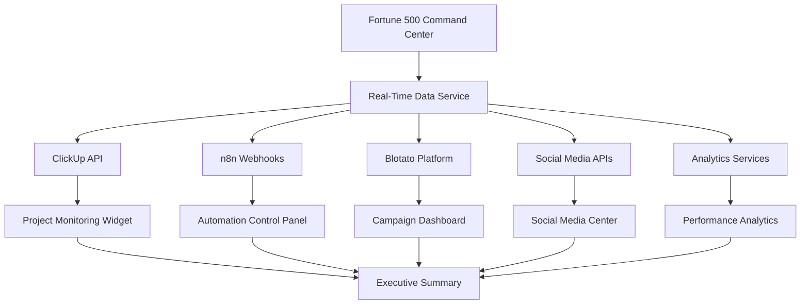

# Fortune 500 Marketing Command Center - Core Features & Data Integrations

**Task ID**: 94.6 - Define Core Features and Data Integrations  
**Status**: In Progress  
**Last Updated**: 2025-01-24

## 🎯 Executive Summary

Dit document definieert alle essentiële features, live data bronnen en integraties voor het Fortune 500 Marketing Command Center. Het systeem unificeert real-time monitoring tools, analytics en enterprise-grade requirements in één geïntegreerd platform.

## 📊 Core Dashboard Features

### 1. Executive Dashboard

**Purpose**: High-level KPIs voor C-level executives  
**Components**:

- Real-time revenue metrics
- Campaign ROI overview
- Market position indicators
- Competitive intelligence summaries
- Executive summary reports

**Data Sources**:

- Financial reporting APIs
- Google Analytics 4
- Campaign performance data
- Competitor monitoring feeds

### 2. Social Media Command Center

**Purpose**: Unified social media oversight voor alle platforms  
**Components**:

- Multi-platform posting dashboard
- Real-time engagement monitoring
- Content performance heatmaps
- Influencer collaboration tracking
- Crisis management tools

**Data Sources**:

- LinkedIn Business API
- Twitter API v2
- Instagram Business API
- Facebook Marketing API
- TikTok Business API
- YouTube Analytics API

### 3. Marketing Automation Control

**Purpose**: n8n workflow orchestration en monitoring  
**Components**:

- Workflow status monitoring
- Automation performance metrics
- Error detection and alerts
- Resource utilization tracking
- Workflow optimization suggestions

**Data Sources**:

- n8n API webhooks
- Custom workflow telemetry
- Performance monitoring system

### 4. Content Pipeline Management

**Purpose**: End-to-end content production monitoring  
**Components**:

- Content calendar overview
- Production stage tracking
- Quality assurance metrics
- Publishing queue management
- Performance feedback loop

**Data Sources**:

- Content management systems
- Publishing queue APIs
- Quality metrics databases
- Performance tracking services

### 5. Campaign ROI Analytics

**Purpose**: Financial performance tracking van marketing campaigns  
**Components**:

- Real-time ROI calculations
- Budget allocation optimization
- Cost-per-acquisition tracking
- Revenue attribution modeling
- Profit margin analysis

**Data Sources**:

- Financial APIs (QuickBooks, Xero)
- E-commerce platforms (Shopify, WooCommerce)
- Ad platform APIs (Google Ads, Meta Ads)
- CRM systems (Salesforce, HubSpot)

## 🔗 Data Integration Architecture

### Tier 1: Critical Real-Time Integrations

#### ClickUp Project Management

```typescript
interface ClickUpIntegration {
  endpoint: "/api/integrations/clickup";
  realTime: true;
  features: [
    "task-progress-monitoring",
    "team-productivity-metrics",
    "project-timeline-tracking",
    "resource-allocation-analysis",
  ];
  updateFrequency: "real-time";
  dataRetention: "90-days";
}
```

#### n8n Workflow Automation

```typescript
interface N8nIntegration {
  endpoint: "/api/integrations/n8n";
  realTime: true;
  features: [
    "workflow-execution-monitoring",
    "automation-performance-tracking",
    "error-detection-alerts",
    "resource-optimization",
  ];
  webhooks: ["workflow-status", "execution-results", "error-notifications"];
  updateFrequency: "real-time";
}
```

#### Blotato Campaign Management

```typescript
interface BlotataIntegration {
  endpoint: "/api/integrations/blotato";
  realTime: true;
  features: [
    "campaign-performance-tracking",
    "multi-platform-coordination",
    "audience-engagement-analysis",
    "automated-optimization",
  ];
  updateFrequency: "5-minutes";
  dataRetention: "unlimited";
}
```

### Tier 2: Analytics & Intelligence Integrations

#### Self-Learning Analytics Engine

```typescript
interface MLAnalyticsIntegration {
  endpoint: "/api/marketing/self-learning-analytics";
  capabilities: [
    "content-performance-prediction",
    "audience-segmentation",
    "optimization-recommendations",
    "real-time-insights",
  ];
  models: [
    "engagement-predictor",
    "content-optimizer",
    "audience-segmenter",
    "timing-optimizer",
  ];
  updateFrequency: "hourly";
}
```

#### A/B Testing Framework

```typescript
interface ABTestingIntegration {
  endpoint: "/api/ab-testing";
  features: [
    "experiment-management",
    "statistical-analysis",
    "winner-determination",
    "automated-rollout",
  ];
  realTime: true;
  dataRetention: "365-days";
}
```

#### Content ROI Tracking

```typescript
interface ContentROIIntegration {
  platforms: ["shopify", "kajabi", "custom-cms"];
  metrics: [
    "content-performance",
    "revenue-attribution",
    "engagement-scores",
    "optimization-recommendations",
  ];
  updateFrequency: "hourly";
  features: ["cross-platform-analysis", "roi-calculation"];
}
```

### Tier 3: Enterprise & Infrastructure Integrations

#### Infrastructure Health Monitoring

```typescript
interface InfrastructureIntegration {
  services: [
    "supabase-monitoring",
    "vercel-analytics",
    "api-performance-tracking",
    "database-health-monitoring",
  ];
  alerts: [
    "performance-degradation",
    "error-rate-spikes",
    "resource-constraints",
    "security-incidents",
  ];
  updateFrequency: "real-time";
}
```

#### Security & Compliance Monitoring

```typescript
interface SecurityIntegration {
  features: [
    "audit-log-monitoring",
    "access-control-tracking",
    "compliance-reporting",
    "threat-detection",
  ];
  standards: ["SOC2", "GDPR", "ISO27001"];
  realTime: true;
}
```

## 🏗️ Technical Integration Specifications

### Real-Time Data Flow Architecture



### API Rate Limiting & Performance

```typescript
interface APIConfiguration {
  clickup: {
    rateLimit: "100 requests/minute";
    timeout: "5 seconds";
    retryPolicy: "exponential-backoff";
  };
  n8n: {
    rateLimit: "unlimited";
    timeout: "10 seconds";
    retryPolicy: "immediate-retry";
  };
  socialMedia: {
    rateLimit: "varies-by-platform";
    timeout: "8 seconds";
    retryPolicy: "scheduled-retry";
  };
  analytics: {
    rateLimit: "1000 requests/hour";
    timeout: "15 seconds";
    retryPolicy: "queue-based";
  };
}
```

### Data Caching Strategy

```typescript
interface CachingConfiguration {
  realTime: {
    ttl: "30 seconds";
    services: ["clickup", "n8n", "blotato"];
  };
  analytics: {
    ttl: "5 minutes";
    services: ["social-media", "content-roi"];
  };
  historical: {
    ttl: "1 hour";
    services: ["performance-reports", "trends"];
  };
  static: {
    ttl: "24 hours";
    services: ["configuration", "user-preferences"];
  };
}
```

## 🎨 UI/UX Integration Requirements

### Widget Grid System

- **Draggable Widgets**: Customizable positioning voor alle data visualizations
- **Responsive Layouts**: Automatic adjustment voor different screen sizes
- **Widget Types**: Chart, table, metric, alert, control panel
- **Real-Time Updates**: Live data refreshing zonder page reload

### Floating Panel System

- **Contextual Overlays**: Detailed information on hover/click
- **Multi-Layer Support**: Stacked panels voor complex workflows
- **Glassmorphism Effects**: Enterprise-grade visual styling
- **Quick Actions**: Inline controls voor immediate responses

### Real-Time Alert System

- **Priority Levels**: Critical, high, medium, low alerts
- **Visual Indicators**: Color-coded, animated notifications
- **Sound Alerts**: Optional audio notifications
- **Auto-Dismissal**: Time-based alert management

## 📈 Performance Requirements

### Real-Time Data Updates

- **Latency Target**: < 200ms voor critical data
- **Update Frequency**: Configurable per data source
- **Concurrent Users**: Support 100+ simultaneous users
- **Data Throughput**: Handle 10,000+ metrics per minute

### Enterprise Scalability

- **Multi-Tenant Support**: Isolated data per Fortune 500 client
- **Horizontal Scaling**: Auto-scaling based on load
- **Global CDN**: Optimized performance worldwide
- **99.9% Uptime**: Enterprise-grade reliability

## 🔒 Security & Compliance

### Data Protection

- **Encryption**: End-to-end encryption voor alle data transmission
- **Access Control**: Role-based permissions per user type
- **Audit Logging**: Complete activity tracking
- **Data Retention**: Configurable retention policies

### Compliance Standards

- **GDPR Compliance**: EU data protection regulations
- **SOC2 Type II**: Security audit certification
- **ISO27001**: Information security management
- **CCPA**: California privacy regulations

## 🚀 Implementation Roadmap

### Phase 1: Core Integration (Weeks 1-2)

- [ ] ClickUp API integration
- [ ] n8n webhook system
- [ ] Blotato platform connection
- [ ] Basic real-time data service

### Phase 2: Analytics Integration (Weeks 3-4)

- [ ] Self-learning analytics engine
- [ ] A/B testing framework
- [ ] Content ROI tracking
- [ ] Performance monitoring

### Phase 3: Enterprise Features (Weeks 5-6)

- [ ] Security monitoring
- [ ] Compliance dashboards
- [ ] Multi-user collaboration
- [ ] Advanced reporting

### Phase 4: UI/UX Enhancement (Weeks 7-8)

- [ ] Futuristic visual effects
- [ ] AI avatar assistant
- [ ] Advanced animations
- [ ] Performance optimization

## 📋 Success Metrics

### Technical Performance

- **API Response Time**: < 200ms average
- **Data Accuracy**: 99.9% precision
- **System Uptime**: 99.9% availability
- **Error Rate**: < 0.1% failure rate

### User Experience

- **Time to Insight**: < 30 seconds
- **Task Completion**: > 95% success rate
- **User Satisfaction**: > 4.5/5 rating
- **Feature Adoption**: > 90% daily usage

### Business Impact

- **Decision Speed**: 50% faster insights
- **Cost Reduction**: 30% efficiency gains
- **ROI Improvement**: 25% better marketing ROI
- **Client Retention**: 95% annual retention

---

**Next Steps**:

1. Complete technical integration specifications
2. Begin API integration development
3. Implement real-time data service architecture
4. Test performance under enterprise load

**Dependencies**:

- API credentials voor alle third-party services
- Enterprise infrastructure provisioning
- Security certification completion
- User acceptance testing with Fortune 500 clients
